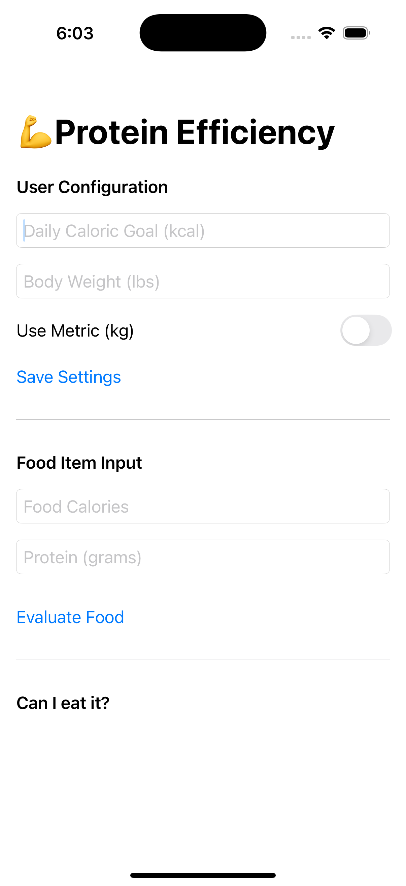

# Protein Calculator iOS App

iOS app built with SwiftUI to evaluate protein makeup percentage of food items based on a user's body weight and caloric goals
ideal for users that want to be in a high protein, low caloric diet

---

## Features

- input daily caloric goal and body weight (lbs or kg)
  - toggle between metric and imperial units
- save settings locally with `@AppStorage`
- evaluate food items by calories and grams of protein
- calculate whether a food item meets your recommended protein range
  - visual cues: meets target, too low, too high
- SwiftUI interface with `ScrollView` and `NavigationView`

## Example UI



---

## Logic Summary

- converts body weight to pounds if metric selected
- recommends 0.8–1.2g protein per lb of body weight
- protein target range: % daily calories (based on weight)
- evaluation compares food's protein calorie ratio vs target

---

## Getting Started

### Requirements

- iOS 15+
- Xcode 13+
- Swift 5.5+

### Installation
**Deployment is only for local**
1. Clone the repo:
   ```bash
   git clone https://github.com/kgunwhi/protein_calculator_ios.git
   
